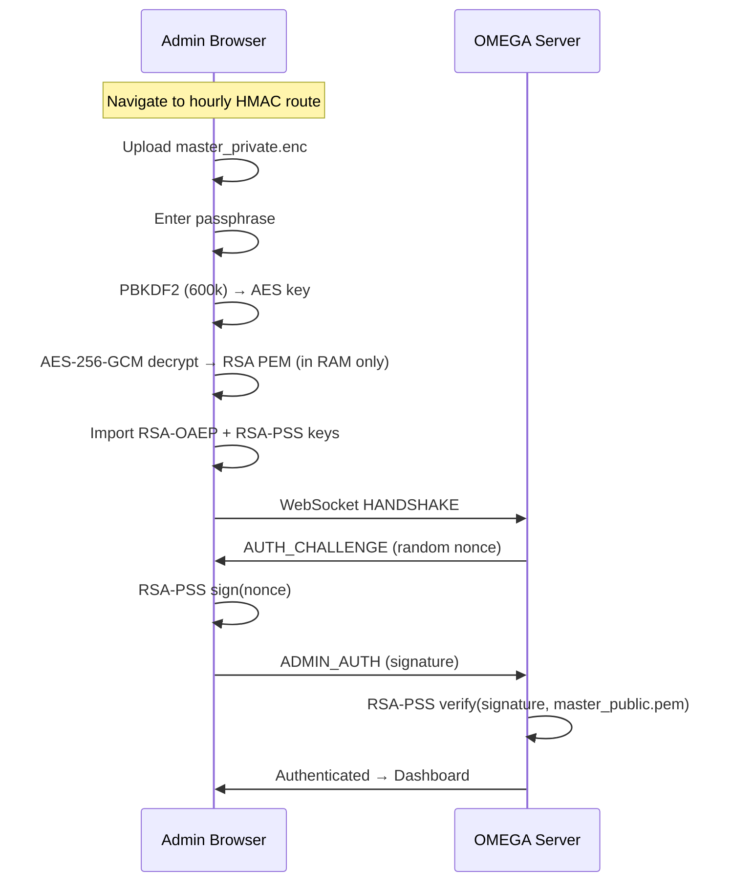

# Protocolo OMEGA (Zero-Knowledge Terminal Architecture & Protocol)

[-green.svg)]()

**Protocolo OMEGA (Zero-Knowledge Terminal Architecture & Protocol)** is a high-security, volatile communication framework designed to operate over untrusted infrastructure (Tor Hidden Services, Blind Relays, or Compromised Nodes). 

The system ensures absolute confidentiality and mathematical immunity against forensic analysis, preventing data persistence at every layer of the stack.

---

## Protocol Topology & Data Flow

```mermaid
graph LR
    subgraph "CLIENT A (Browser)"
    A[WebCrypto Engine] --> B[PBKDF2 600k Iterations]
    B --> C[AES-256-GCM Encrypt]
    C --> D[4096B Strict Padding]
    end

    D -- "ECDH Ephemeral Channel (Tor/Onion)" --> E

    subgraph "BLIND RELAY (Node.js Server)"
    E[Memory-Only Buffer] --> F[Zero-Persistence Vault]
    F -- "Broadcast" --> G
    end

    G -- "Constant Bitrate Stream" --> H

    subgraph "CLIENT B (Admin/User)"
    H[Strict Frame Parsing] --> I[Web Worker Isolation]
    I --> J[AES-256-GCM Decrypt]
    J --> K[Volatile Memory Purge]
    end
```

---

## Security Core (Hardening Features)

### 1. Autonomous Cryptographic Engine
The protocol implements a multi-layered encryption stack using the native **WebCrypto API**, eliminating third-party library dependencies and mitigating supply chain attacks.
*   **Key Exchange:** RSA-OAEP (4096-bit) with SHA-256 for identity authentication.
*   **Perfect Forward Secrecy:** True PFS via an ephemeral **ECDH (P-256)** key exchange. The resulting shared secret is strictly bound to the message encryption key. Compromising the master RSA key does **NOT** allow decryption of historical traffic.
*   **Stream Security:** AES-256-GCM with unique Initialization Vectors (IV) per frame.
*   **Signature Scheme:** **RSA-PSS** (Probabilistic Signature Scheme) with 32-byte salt for identity verification (Admin Command & Control).
*   **Two-Stage Key Derivation:** A robust PBKDF2 $\rightarrow$ HKDF pipeline. **Stage 1 (PBKDF2):** 600,000 iterations of HMAC-SHA256 against the static session token provides brute-force resistance. **Stage 2 (HKDF):** Binds the ephemeral ECDH shared secret as the salt, ensuring mathematically sound Forward Secrecy.

### 2. Encrypted-At-Rest Key Management
All cryptographic secrets are protected at rest — plaintext key material **never** persists on disk.
*   **Master Private Key:** Encrypted with AES-256-GCM, key derived via **PBKDF2** (600,000 iterations, SHA-256) from an admin passphrase. Stored as `master_private.enc`.
*   **Browser-Side Decryption:** The admin panel decrypts `master_private.enc` **entirely in the browser** using WebCrypto PBKDF2. The plaintext key exists only in volatile RAM — it never reaches the server.
*   **Admin HMAC Secret:** Derived deterministically from the admin passphrase via scrypt — no `admin_token.txt` file ever exists.
*   **Server Nonce:** A random 32-byte nonce generated per keygen cycle, adding entropy to admin route rotation and preventing prediction attacks.
*   **Legacy Purge:** On startup, the launcher securely overwrites and deletes any legacy plaintext files (`master_private.pem`, `admin_token.txt`) with random data before unlinking.

### 3. Traffic Analysis Mitigation (DPI Defense)
*   **Strict Padding:** Every payload is packed into a fixed-size **4096-byte** binary ArrayBuffer. This nullifies length-based side-channel analysis.
*   **Stochastic Chaffing:** Asynchronous injection of synthetic noise frames via randomized timers to obfuscate temporal patterns.
*   **Adaptive Proof of Work (PoW):** SHA-256 based PoW challenges with **dynamic difficulty** (16–24 bits) that scales with server connection load to prevent Asymmetric DoS attacks.

### 4. Volatile Anti-Forensics Layer
The OMEGA Protocol is designed for **Zero-Persistence**.
*   **Memory Hygiene:** TypedArrays (`Uint8Array`) are used for plaintext processing and are sanitized using `.fill(0)` and CSPRNG noise injection immediately after use.
*   **Automatic 24h Purge:** The server implements a mandatory cleanup cycle that wipes the message vault (RAM and Disk) every 24 hours, ensuring ephemerality.
*   **Zero-Store Keys:** Session tokens and private keys never touch the server's disk; they reside only in the volatility of the browser's memory and the server's RAM during transport.
*   **Volatile Identity Rotation**: Generación de una nueva dirección `.onion` en cada inicio del sistema (Onion Evasion) para evitar el rastreo a largo plazo.
*   **EXIF/IPTC Stripping**: JPEG files sent via the admin panel have APP1 (EXIF) and APP13 (IPTC) metadata stripped before encryption — preventing de-anonymization via GPS, device info, or software fingerprints.

### 5. Session Governance & Access Control
*   **Session Expiry:** All sessions expire after 1 hour, requiring re-authentication.
*   **Concurrency Governance:** Maximum 2 connections per session ID, with a 500-connection global threshold.
*   **Admin Route Rotation:** Hourly HMAC-derived admin paths with serverNonce entropy — routes cannot be pre-calculated even with leaked secrets.
*   **Input Sanitization:** All user-provided fields are validated and stripped of control characters before processing.
*   **Vault Write Mutex:** Promise-chained serialization prevents race conditions and JSON corruption under concurrent write pressure.

---

## Integrity & Build Pipeline
The client-side logic is hardened through integrity verification rather than security-through-obscurity:
*   **Kerckhoffs' Principle:** Obfuscation has been **removed** — security resides in the keys, not in hiding the algorithm. Code is minified, not obfuscated.
*   **Worker Integrity:** A `GOLD_HASH` (SHA-512) validation ensures the Web Worker has not been tampered with in transit (pre-spawning verification).
*   **Worker Attestation:** **Server-side** HMAC-based challenge-response attestation ensures runtime integrity of the cryptographic worker. The server — not the client — dictates and verifies attestation.
*   **Zero Dependencies for Crypto:** All cryptographic operations use the native WebCrypto API — no third-party libraries in the critical path.
*   **Framework Hardening:** `X-Powered-By` disabled, ETags suppressed, global error handler prevents path disclosure.

---

## Admin Authentication Flow

The admin panel implements a **zero-trust, browser-side decryption** pipeline:

**Key principle:** The server **never** sees the private key or the passphrase. Authentication is proven via RSA-PSS challenge-response — the server only holds the public key.

---

## Audit Results (v3.1)

A formal offensive cryptographic audit was performed under a **Zero Trust** mentality. All findings have been remediated:

| # | Finding | Severity | CVSS | Status |
|---|---------|----------|------|--------|
| 1 | **Plaintext Token Leakage** — Token sent in cleartext in INIT/ASYNC_MSG frames | CRITICAL | 9.8 | [OK] FIXED |
| 2 | **Weak Key Derivation Salt** — Username used as PBKDF2 salt (low entropy) | HIGH | 7.4 | [OK] FIXED |
| 3 | **Client-Side Attestation Flaw** — Client self-validated attestation challenges | CRITICAL | 8.5 | [OK] FIXED |
| 4 | **EXIF Metadata Leakage** — JPEG files sent without stripping EXIF/IPTC | HIGH | 6.8 | [OK] FIXED |
| 5 | **Vault Race Condition** — Concurrent `fs.writeFile` calls corrupt `vault.json` | MEDIUM | — | [OK] FIXED |
| 6 | **Fake PFS Implementation** — ECDH secret generated but inert. Replaced with PBKDF2 -> HKDF | CRITICAL | 9.8 | [OK] FIXED |
| 7 | **Zero Trust HMAC Leak** — Attestation private key sent to server. Migrated to ECDSA | CRITICAL | 8.5 | [OK] FIXED |

> Full reports: 
> - [Red Team Audit Report](audit_reports/RedTeam_OMEGA_Audit_Report.md)
> - [Internal Remediation Document](audit_reports/Remediacion_Interna_PFS_Atestacion.tex)

---

## Deployment (Zero-Config Operator Setup)
Protocolo OMEGA v3.1 introduces a **Native Desktop Client** (Electron) designed to completely abstract the complexity of Tor, Node.js, and cryptographic key generation. This enables non-technical operators (journalists, activists) to deploy an IRONCLAD communication relay with zero command-line interaction.

### Native Desktop Features
1. **Automated Keygen:** Visual passphrase prompt for RSA-4096 key generation and encrypted-at-rest storage.
2. **Embedded Tor:** Bundles the Tor binary and dynamically generates `torrc` configurations, bypassing port collisions and read-only permission errors.
3. **Volatile Identity:** Automatically wipes previous hidden service keys and bootstraps a new `.onion` address upon every launch.
4. **Local Dashboard Bridge:** Securely routes the operator to their local, encrypted admin dashboard (`localhost:3000/route`) while clients connect via the `.onion` network.
5. **Neo-Brutalist Minimalism:** A stark, clean, high-contrast user interface that completely eliminates distractions and hacker movie tropes, designed for functional purity.
6. **Cross-Platform Compilation:** Supports Windows `.exe` via NSIS and Linux `.AppImage` (the standard for **Tails OS**).

### Quick Start (Compiled Binary)
1. Download the compiled release for the target operating system (`.exe` for Windows, `.AppImage` for Linux or Tails).
2. Execute the binary with a double-click (no installation or terminal interaction required).
3. Follow the on-screen prompt to configure the Master Passphrase (minimum 12 characters).
4. Wait for the Tor subsystem to bootstrap (indicated by a 0% to 100% progress indicator).
5. Copy the generated `.onion` link and distribute it to the intended contact through a secure side channel.
6. Open the Admin Panel to monitor and manage incoming communications.

> **The passphrase must be stored securely.** No password recovery mechanism exists. Without the passphrase, the master identity is cryptographically irretrievable.

---

## Security Posture

| Layer | Mechanism | Standard |
|-------|-----------|----------|
| **Key Exchange** | RSA-4096 + ECDH P-256 | NIST SP 800-56A |
| **Stream Cipher** | AES-256-GCM | NIST SP 800-38D |
| **Key Derivation** | PBKDF2 (600k) + HKDF | OWASP 2025 |
| **KDF Salt** | sessionId + ecdhSecret (E2EE, never transmitted) | High-entropy |
| **Signatures** | RSA-PSS (32-byte salt) | PKCS#1 v2.1 |
| **Key Storage** | AES-256-GCM + PBKDF2 (600k) | Encrypted-at-rest |
| **Admin Auth** | Browser-side decrypt + RSA-PSS C/R | Zero-trust |
| **Attestation** | Server-side ECDSA verify + P1363 | Zero-knowledge |
| **Forward Secrecy** | E2EE ECDH (Client↔Admin) + HKDF ephemeral | True PFS (VULN-04 fixed) |
| **Anti-DoS** | Adaptive PoW (16–24 bit) | Dynamic scaling |
| **Anti-Forensics** | EXIF/IPTC strip + 24h vault purge | Zero-persistence |
| **Transport** | Tor Hidden Service | Onion routing |

---

## License

**GNU General Public License v3.0 (GPLv3)** — See [LICENSE](LICENSE).

This project is Free Software: you can redistribute it and/or modify it under the terms of the GNU GPLv3 as published by the Free Software Foundation.

---

## Auditing Disclaimer
> *"A 100% secure system does not exist; there are only systems that are prohibitively expensive to hack."*

Protocolo OMEGA is built on the principle of **Attack Cost Maximization**. By combining encrypted-at-rest key management, Perfect Forward Secrecy, aggressive memory hygiene, traffic normalization, and adaptive proof-of-work, the infrastructure forces adversaries to expend computational resources they are unlikely to invest for standard interception.

---

**Developed by Eduardo "Noir0x63" Camarillo**
[noir0x63.github.io](https://noir0x63.github.io)
